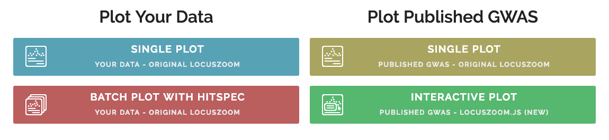
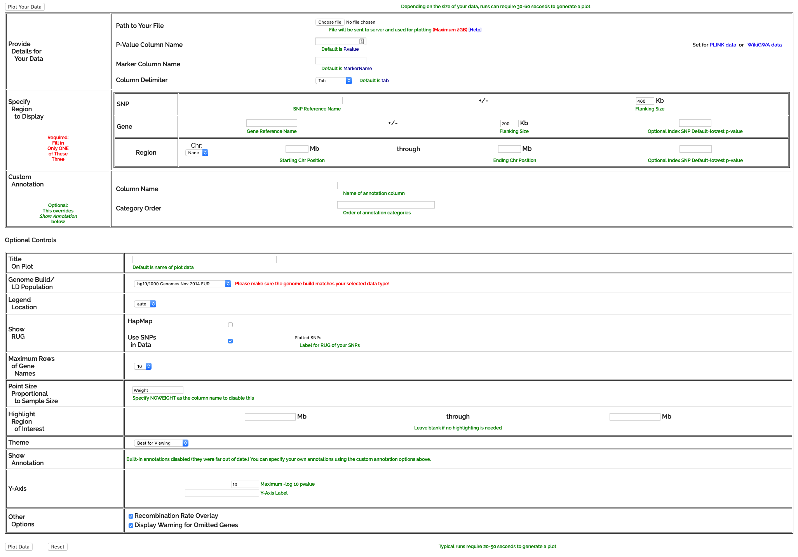

# What is LocusZoom (Ford)
PLZ DO NOT COPY THE CONTENT IN THE WEBSITE TO ANSWER HERE!!!!! PARAPHRASE IT!!!

# Getting Started (Ford)
Explanation of components in the website, what it can do?, What are the different of 4 modes? (Single Plot with your own data, single plot with published GWAS Data, Batch Plot with HITSPEC and Interactive plot with published GWAS)

# Quickstart
This will show you how to get started using LocusZoom to visualise the GWAS data within web browser.

## LocusZoom Structure

### [[Plot]]

A [[Plot]] is an instance of LocusZoom, returned by the `populate()` method. A plot has a layout and various supported methods.

### [[Panel]]

A [[Panel]] is a subdivided area of a plot. Panels contain graph features such as titles and axes, but not actual data. Panels occupy the full width the of the plot and are stacked vertically along the y-axis in the order they are added unless directed differently by their layouts.

### [[Data Layer]]

A [[Data Layer]] is a layer within a panel for representing data. Data layers are stacked depth-wise along the z-axis in the other they are added unless directed differently by their layouts.

### [[Dashboard]]

A [[Dashboard]] is an HTML element that can contain information or user interface components relevant to a plot. Dashboards can be attached to the plot as a whole or to individual panels. They are described with their own layouts nested within the layouts of the parent plot or panel.

### [[Legend]]

A [[Legend]] is an SVG element belonging to a panel that annotated categories of data shown on the underlying data layers. Legends are described in general terms as a part of a panel's layout and the specific elements to appear in the legend are described by each of the panel's data layers.

## Top-level Library Methods

Locuszoom.js creates an global object namespace called `LocusZoom`. This object has the following methods:

* **`LocusZoom.populate(selector, datasource, [layout])`**  

Populate a single DOM element with a LocusZoom plot.  
* `selector` *string, required* - DOM query selector string.  
* `datasource` *object, required* - A valid [[Data Sources]] object that defines the namespaces and methods for retrieving data.  
* `layout` *object, optional* - A valid [[Layout|Layouts]] object that defines the geometry and behaviors of the plot. If not provided the standard association plot layout will be used.  

* **`LocusZoom.populate(selector, datasource, [layout])`**  

Identical to `LocusZoom.populate()` but will generate plot in *all* elements that match the DOM query selector string, not just the first found.  

* **`LocusZoom.positionIntToString(pos, exp, suffix)`**  

Convert an integer position to a string (e.g. `23423456` => `"23.42 (Mb)"`)  
* `pos` *integer, required* - Position value.  
* `exp` *integer, optional* - Exponent of the returned string's base (e.g. 3 for Kb, 6 for Mb, regardless of the value of `pos`). If not provided returned string will select smallest base divisible by 3 for a whole number value.   
* `suffix` *boolean, optional* - Whether or not to append a suffix (e.g. "Mb") to the end of the returned string. Defaults to `false`.  

* **`LocusZoom.positionStringToInt(pos)`**  

Convert a string position to an integer (e.g. `"5.8 Mb"` => `58000000`)
* `pos` *integer, required* - Position value.  

* **`LocusZoom.getToolTipData(node)`**  

Method for use in custom javascript within a tooltip's custom HTML to gain access to the data that generated the tooltip. Works recursively to locate the parent tooltip element regardless of how nested an element is in the custom HTML. For example, this custom button element in a tooltip would log the tooltip's underlying data to the console:  

`<button onclick="console.log(LocusZoom.getToolTipData(this);">Click Me</button>`  

* **`LocusZoom.getToolTipDataLayer(node)`**  

Method for use in custom javascript within a tooltip's custom HTML to gain access to the data layer containing the element that generated the tooltip. Works recursively to locate the parent tooltip element regardless of how nested an element is in the custom HTML. For example, this custom button element in a tooltip would log the data layer containing the element that generated the tooltip to the console:  

`<button onclick="console.log(LocusZoom.getToolTipDataLayer(this);">Click Me</button>`  

* **`LocusZoom.getToolTipPanel(node)`**  

Method for use in custom javascript within a tooltip's custom HTML to gain access to the panel containing the data layer and element that generated the tooltip. Works recursively to locate the parent tooltip element regardless of how nested an element is in the custom HTML. For example, this custom button element in a tooltip would log the tooltip's parent panel to the console:  

`<button onclick="console.log(LocusZoom.getToolTipPanel(this);">Click Me</button>`  

* **`LocusZoom.getToolTipPlot(node)`**  

Method for use in custom javascript within a tooltip's custom HTML to gain access to the parent plot that generated the tooltip. Works recursively to locate the parent tooltip element regardless of how nested an element is in the custom HTML. For example, this custom button element in a tooltip would log the tooltip's parent plot to the console:  

`<button onclick="console.log(LocusZoom.getToolTipPanel(this);">Click Me</button>`  

## Choosing Analysis Mode

LocusZoom provides 4 modes for visualising GWAS data. In this step, you need to choose the mode of analysis including Single Plot with your owned data, single plot with published GWAS data, batch plot with HITSPEC and interactive plot with published GWAS data. It depends on the data you want to use. If you want to use the published data, you can choose whether single and interactive plot. Otherwise, use your owned data by choosing a single plot with your owned data or batch plot with Hispec.

The difference between the single plot with published GWAS data and the interactive plot is the output from the program. Single plot returns an analysis result as a PDF file which is suitable for making a report while an interactive plot shows the result in the webpage and allows you to investigate the data in more detail.

## Selecting Dataset

In this example, we focus on using the interactive plot. After select `Interactive Plot`, this page will show up. You may begin by searching for an interested dataset in the search bar. Next, you might navigate through the result from pagination. If the interested dataset has been found, you may click at 'ADD TO PLOT'. The result will appear on top of the webpage.

If you choose to upload your GWAS data, there is a form for upload and place for fill in the configuration of the visualisation. After filling in the data, you may click at `Plot Your Data` button to get the visualisation of your data.

# How to Interpret the Result (Beer)
