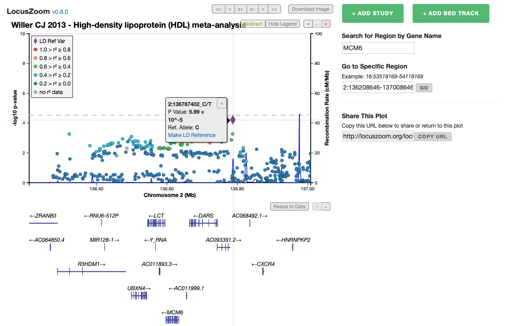
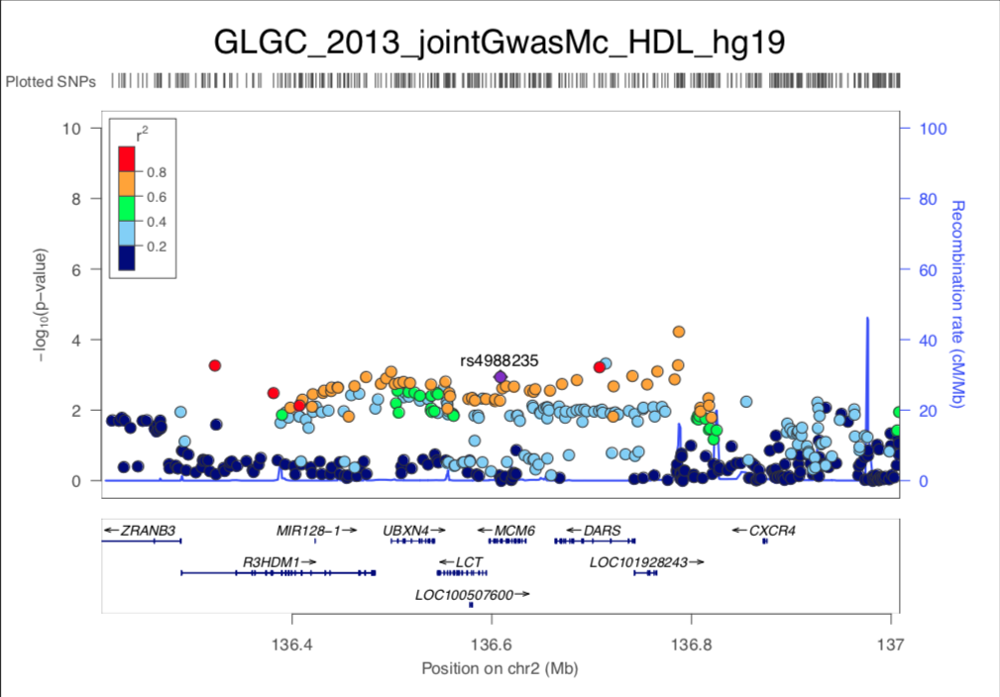
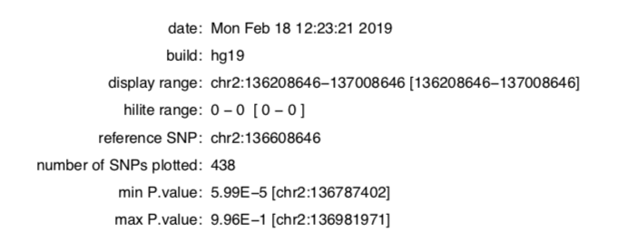

# What is LocusZoom (Ford)
PLZ DO NOT COPY THE CONTENT IN THE WEBSITE TO ANSWER HERE!!!!! PARAPHRASE IT!!!

# Getting Started (Ford)
Explanation of components in the website, what it can do?, What are the different of 4 modes? (Single Plot with your own data, single plot with published GWAS Data, Batch Plot with HITSPEC and Interactive plot with published GWAS)

# Quickstart
This will show you how to get started using LocusZoom to visualise the GWAS data within web browser.

## Choosing Analysis Mode

LocusZoom provides 4 modes for visualising GWAS data. In this step, you need to choose the mode of analysis including Single Plot with your owned data, single plot with published GWAS data, batch plot with HITSPEC and interactive plot with published GWAS data. It depends on the data you want to use. If you want to use the published data, you can choose whether single and interactive plot. Otherwise, use your owned data by choosing a single plot with your owned data or batch plot with Hispec.

The difference between the single plot with published GWAS data and the interactive plot is the output from the program. Single plot returns an analysis result as a PDF file which is suitable for making a report while an interactive plot shows the result in the webpage and allows you to investigate the data in more detail.

## Selecting Dataset

In this example, we focus on using the interactive plot. After select `Interactive Plot`, this page will show up. You may begin by searching for an interested dataset in the search bar. Next, you might navigate through the result from pagination. If the interested dataset has been found, you may click at 'ADD TO PLOT'. The result will appear on top of the webpage.

If you choose to upload your GWAS data, there is a form for upload and place for fill in the configuration of the visualisation. After filling in the data, you may click at `Plot Your Data` button to get the visualisation of your data.

# How to Interpret the Result
Plot published GWAS has two modes include single plot and interactive plot

**1. Single plot**
- Choose Pre-loaded data type by selecting trait group and data file.
- Specify region to display by fill in only of SNP reference name, Gene reference name, or region
- Use option controls to add more specific details such as Genome Build/LD Population for choosing reference genome from population
- Click Plot data. PDF files downloaded to computer.

**2. Interactive plot**
- Use the + ADD STUDY and + ADD BED TRACK buttons to add other published GWAS results and published annotation (BED) tracks.
- Use the X button which appears when cursor is on the plot to remove data.
- Explore different regions in the genome in a variety of different ways:
    - Click and drag the plot to pan left/right
    - Shift+Scroll the mouse wheel to zoom in or out
    - Click and drag x-axis or y-axis ticks to scale that axis
    - Shift+click and drag x-axis or y-axis ticks to pan along that axis
    - Use the Pan / Zoom Region buttons to navigate around the currently shown region
    - Use the Show Region by Gene dropdown to jump to regions centered around preselected genes
    - Go to specific region by enter the format chr:start-end
- Click on genes or variants in any part of the plot for more information about them
- Use the up and down buttons to swap the plot up and down
- Use the Abstract button to see more information about the data that panel is showing
- Click and drag the bars between panels to resize them
- Use the Download Image button to export an SVG image of the plot, suitable for converting to PDF or any other image format

***Features and functionality***

Fig. 1. An example LocusZoom plot showing the HDL cholesterol-associated region near the MCM6 gene from interactive mode

Fig. 2. An example LocusZoom plot showing the HDL cholesterol-associated region near the MCM6 gene from single mode and details.

- The main panel of a LocusZoom plot shows association P-values on the -log10 scale on the vertical axis, and the chromosomal position along the horizontal axis.
- The user can specify the region to display in one of three ways:
  1. an index SNP and a window size
  2. the chromosome together with start and stop positions
  3. gene name and size of flanking region.
- The plots were designed to display ~1 Mb windows of the genome, although for regions with several association signals or long-range LD patterns, plots extending further can be drawn.
- To identify SNPs that may be potentially causative, LocusZoom plots show not only the magnitude of association for each SNP, but also the pairwise LD pattern with the most strongly associated SNP or another user-specified SNP.
- Quick inspection can reveal the extent of the associated region and the location and number of SNPs in strong LD with the index SNP. In addition, a locus may show strongly associated variants that are weakly correlated, suggesting the presence of multiple independent association signals.
- Users may choose to display LD (r^2). LocusZoom is compatible with 1000 Genomes SNP naming format (chr:position) and will plot association results for novel SNPs identified by sequencing studies.
- The bottom panel of a LocusZoom plot shows the name and location of genes. Positions of exons are displayed, and the transcribed strand is indicated with an arrow. This allows the visual comparison of association results relative to coding regions. Gene names are automatically spaced relative to one another to avoid overlap.
- The details from graph including:
  - date: show date and time that interpret the graph
  - build: reference genome (ie. hg19 is human genome)
  - hilite range
  - reference SNP: chromosome:SNP's position (ie. chr2:136608646)
  - number of SNPs plotted
  - min P.value
  - max P.value

 Smaller p value means more power of the association effect between variant on metabolic traits.
