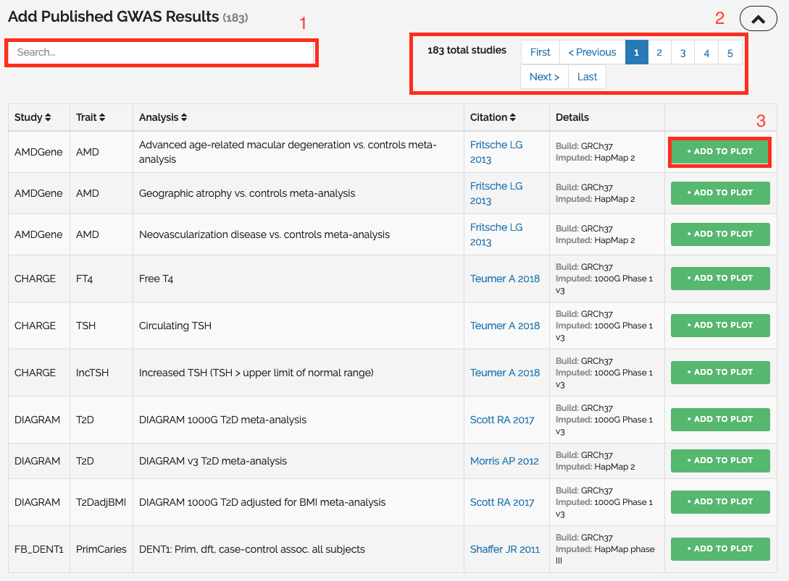

# What is LocusZoom (Ford)
PLZ DO NOT COPY THE CONTENT IN THE WEBSITE TO ANSWER HERE!!!!! PARAPHRASE IT!!!

# Getting Started (Ford)
Explanation of components in the website, what it can do?, What are the different of 4 modes? (Single Plot with your own data, single plot with published GWAS Data, Batch Plot with HITSPEC and Interactive plot with published GWAS)

# Quickstart
This will show you how to get started using LocusZoom to visualise the GWAS data within web browser.

## LocusZoom Structure

### [[Plot]]

 [[Plot]] is the main option in LocusZoom, using by the `populate()` method. A plot has a layout and various supported methods.

### [[Panel]]

[[Panel]] is a subdivided area of a plot which contain graph features for example titles and axes. 

### [[Data Layer]]

 [[Data Layer]] is a layer within a panel for representing data. 

### [[Dashboard]]

[[Dashboard]] is an HTML element which contain information and user interface components relevant to a plot. Dashboards can be use to attach the plot as a whole or to individual panels. 

### [[Legend]]

[[Legend]] is an SVG element in panel which present the categories of data shown on the underlying data layers. 

## Choosing Analysis Mode

LocusZoom provides 4 modes for visualising GWAS data. In this step, you need to choose the mode of analysis including Single Plot with your owned data, single plot with published GWAS data, batch plot with HITSPEC and interactive plot with published GWAS data. It depends on the data you want to use. If you want to use the published data, you can choose whether single and interactive plot. Otherwise, use your owned data by choosing a single plot with your owned data or batch plot with Hispec.

The difference between the single plot with published GWAS data and the interactive plot is the output from the program. Single plot returns an analysis result as a PDF file which is suitable for making a report while an interactive plot shows the result in the webpage and allows you to investigate the data in more detail.

## Selecting Dataset

In this example, we focus on using the interactive plot. After select `Interactive Plot`, this page will show up. You may begin by searching for an interested dataset in the search bar. Next, you might navigate through the result from pagination. If the interested dataset has been found, you may click at 'ADD TO PLOT'. The result will appear on top of the webpage.

If you choose to upload your GWAS data, there is a form for upload and place for fill in the configuration of the visualisation. After filling in the data, you may click at `Plot Your Data` button to get the visualisation of your data.

# How to Interpret the Result (Beer)
